# IMS - Software Development Plan

## Github Repository

https://github.com/Ryuukishi/IMS

## Installation

1. Install Ruby by following the [official documentation](https://www.ruby-lang.org/en/documentation/installation/). Ruby versions 2.4.0 and above are required.
2. If you have Git installed on your machine, you can clone this repository using `git clone https://github.com/Ryuukishi/IMS.git`
3. If you don't have Git, go to the top of this page, click `Code` → `Download ZIP` and extract the archive onto your machine. 
4. Navigate to the `src` directory and install the gems required to run this application by either running the bash script `./INSTALL.sh` or manually installing them using bundler:

   - First, install bundler if it isn't already installed using `gem install bundler`
   - And then run the command `bundle install` in the source directory to install the required gems
5. Finally, run the app by using `ruby start.rb`. Voila!
   

## Statement of purpose and scope

IMS stands for Inventory Management System and it’s a simple terminal app that allows users to manage and store their inventory. IMS is a CRUD application meaning that users can Create, Read, Update, and Delete data within the app. The target audience for this app are mainly small businesses and individuals. IMS can be seen as a free and lightweight alternative to professional accounting software such as MYOB. IMS differentiates itself by having an easy-to-use and intuitive interface without all the clutter. There won't be any buttons you have to click or graphical menus you have to navigate, instead all a user needs to do is use their keyboard to select the relevant option from the menu and input relevant information. According to MYOB's website, their lowest tier of accounting software costs around $30/month. If the individual or small business is a reporting entity, then this might be a good option, but if one just wants a simple app to track their inventory then I believe that IMS is a good alternative. 

## Features

1. Easy-to-use and intuitive menu system - When you start the app, all the options available to the user will be displayed as a selection menu. The user can quickly browse and select menu options by using their keyboard arrow keys and uses can even cycle through options in the app. This makes it easier to use compared to a terminal application, where you have to write out all the commands. The menu is designed to cycle through the options e.g. when the user reaches the bottom of the menu 'Quit' and presses the down arrow key again, it will cycle back to the beginning of the menu. When the app is first run, the app will check whether a previous save file exists or not. If it exists, then all the options available to the user will be opened up. If it doesn't exist, or if the save file is empty, then some options will be disabled until the user inputs some items into the inventory.

   
   

   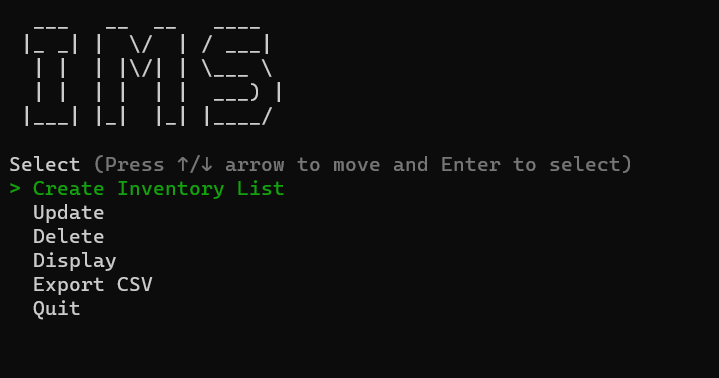

   

   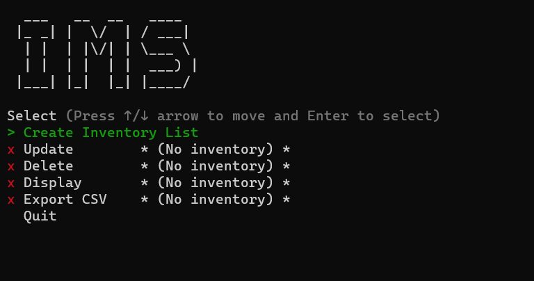

2. IMS is a full CRUD application and users can create an inventory by inputting individual items. The inventory will be saved onto the disk and will be loaded every time the app is run. The user can modify the data by either updating or deleting the items from the inventory, and all changes will again be saved onto the disk. The saving and loading of data is run entirely in the background and is automated every time a change is made so that the data is always up to date.
3. Another feature that will be appealing to the user is the ability to export the inventory data as a CSV (comma-separated values) file, which can then be loaded into programs such as Microsoft Excel. This allows users to perform additional calculations using the data generated by the app. CSV is flexible because it is human readable and can easily be read inside any text-editor. 
4. Using the tty-table gem, users can display their entire inventory inside their terminal. The table will be formatted with headings and each item will be formatted so that it will be easy to read.

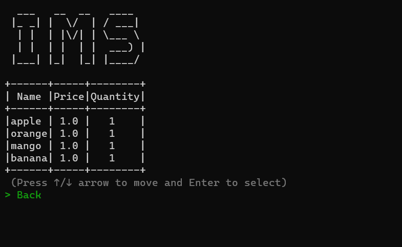

## User interaction and experience

### Interactive menu

When first running the app, the user will be brought to the main menu (see above). The user can then interact with the menu by using the up and down keyboard keys and when they want to select an option, they just press enter. As mentioned previously, certain menu options will be disabled if the inventory does not exist or is empty so it;s necessary for the user to first add some items to the inventory.

### CRUD

To add inventory, users need to select `Create inventory list` from the menu and then enter the name of the item they wish to add.

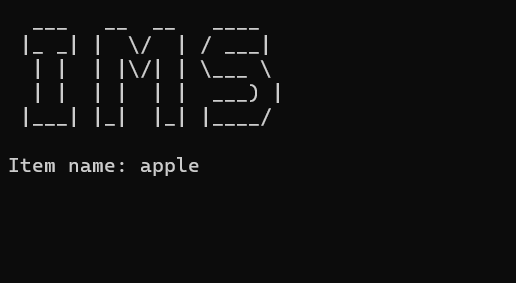

Users then need to add the price. Price needs to be a positive number so inputting letters or a negative number will result in an error. Likewise, quantity also needs to be a positive number and will not accept letters.

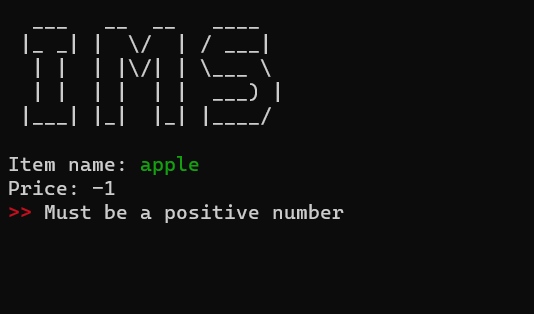

Once an item is added, a table will be displayed summarising the details of the item as a table and will ask the user whether they would like to add another item or finish and return to the main menu.

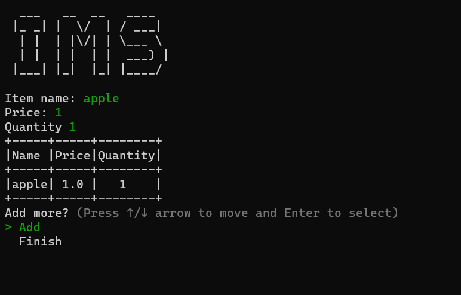

Next, the user has the option to update or delete items from the inventory. If a user tried to delete or update an item that is not in the inventory, the app will return an appropriate error. 

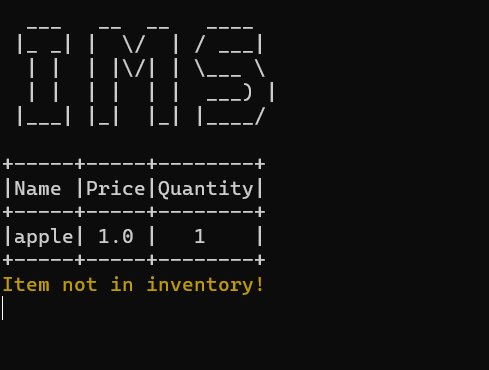

When a user updates an item, they can choose to update the price or the quantity. A table will be displayed on top so that the user will know what items are available.

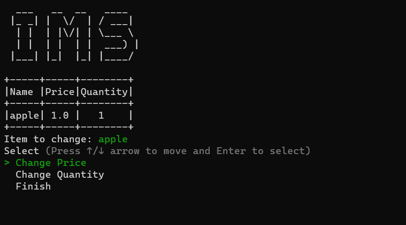

### Exporting data to a CSV file

Once item are added into the inventory, the user can export the data as a CSV file by selecting the `Export CSV` option from the main menu. The app will display the following message and the file `Inventory.csv` will be saved in the same folder as the app and can be opened in a text-editor or spreadsheet program such as Excel.

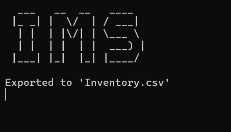

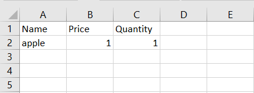

### Displaying items as a table

Users can see the entire list of items saved in their inventory by choosing the `Display` option from the menu. The list of items will be beautifully formatted as an ascii table along with the relevant headings.

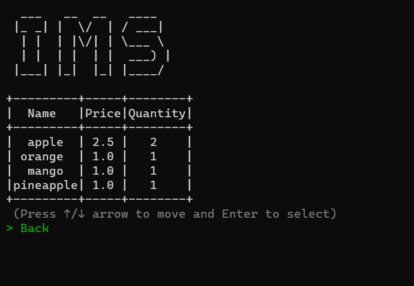

## Flowchart

## Trello Board

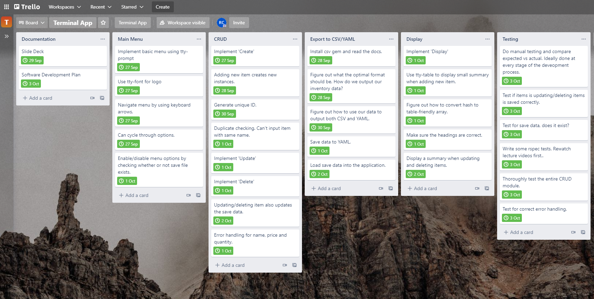

## Manual Testing

|                 Component                 |                         Description                          |                           Expected                           |                Actual                | Is this an issue? |                           Comments                           |
| :---------------------------------------: | :----------------------------------------------------------: | :----------------------------------------------------------: | :----------------------------------: | :---------------: | :----------------------------------------------------------: |
|    Main menu, save file doesn't exist     |           Check if file exists and if it's empty.            |            Update/Delete/Display/Export disabled             |             As expected              |         N         |                                                              |
| Main file, save file exists but is empty  |           Check if file exists and if it's empty.            |            Update/Delete/Display/Export disabled             |      Menu options were enabled       |         Y         | The app initially only checked whether a save file exists or not. It now also checks whether the save file is empty. |
| Main file, save file exists and not empty |           Check if file exists and if it's empty.            |             Update/Delete/Display/Export enabled             |             As expected              |         N         |                                                              |
|                Item check                 | Checks whether an item exists, and also whether an item is a duplicate. | Return error if item already exists or if it's a duplicate.  |             As expected              |         N         |                                                              |
|     Type check for price and quantity     |  Should only allow float/int for price and int for quantity  |              Returns error if wrong data type.               |             As expected.             |         N         | Use tty-prompt's built-in validation to handle wrong input.  |
|      Update item price and quantity       | Ensure that when a user updates an item's attributes, the save data is also updated. |        Item information should be saved once updated.        | Information was not saved correctly. |         Y         | Due to an error within the loop, the updated data wasn't being saved correctly. This has been fixed. |
|                  Delete                   | Deleting an item should remove that item from the save file. |                Item is deleted from save file                |             As expected              |         N         |                                                              |
|                  Delete                   |             Deleting the last item from the list             | If the last item got deleted then the save file is empty and returning to the main menu should result in options being disabled. |             As expected              |         N         |                                                              |
|                  Display                  |              Display inventory items as a table              | Table should be correctly formatted and with the correct headings. |             As expected              |         N         |                                                              |
|                  Export                   |                  Exporting data to CSV file                  | CSV file should be outputted correctly and should display correctly when viewed using a text editor and Excel. |             As expected              |         N         |                                                              |
|                   Save                    |                       Update save data                       |     Inventory data is saved after every CRUD operation.      |             As expected              |         N         | As mentioned above, data wasn't saved after updating an item's price and quantity but this has since been fixed. |
|                   Load                    |                        Load save data                        |            Loads save data if it exists/not empty            |             As expected              |         N         |                                                              |

